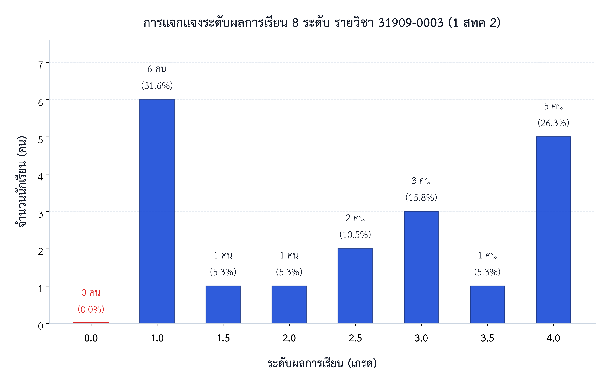
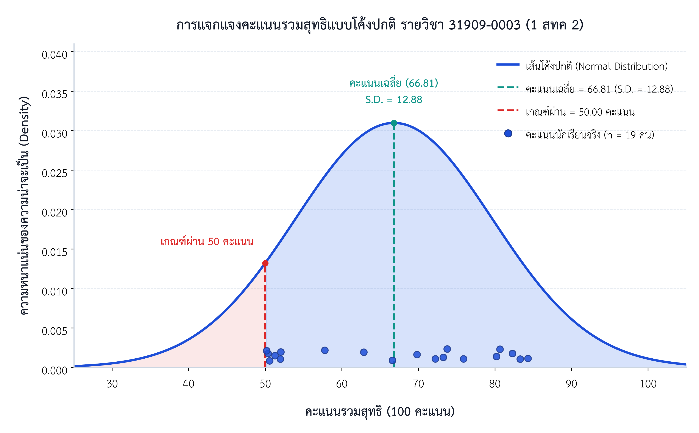

# 📊 ระบบประมวลผลคะแนน วิเคราะห์ผลการเรียน และจำลองการตัดเกรด (20 : 50 : 10 : 20)

[-orange.svg)](https://github.com/PichyyyNews/web-database-grading-analysis-31909-0003)

ระบบรวบรวม บริหารจัดการข้อมูลผลการเรียน จับคู่อีเมลบัญชีส่วนตัวกับรหัสนักศึกษาใน Google Classroom รวบรวมคะแนนสอบกลางภาคและปลายภาค (ปรนัย 40 + อัตนัย 60 เต็ม 100) จัดหมวดหมู่คะแนนเก็บแบบฝึกหัด 13 ชิ้นงาน และจัดทำแบบจำลองการตัดเกรดมาตรฐานสำนักงานคณะกรรมการการอาชีวศึกษา (สอศ.) สัดส่วน **20 : 50 : 10 : 20** สำหรับนักศึกษาระดับชั้น **ประกาศนียบัตรวิชาชีพชั้นสูง (ปวส.) ชั้นปีที่ 1 สาขาวิชาเทคโนโลยีสารสนเทศ ห้อง 1 สทค 2 (กลุ่ม ม.6 รวม 19 คน)**

---

## 📈 แผนภูมิสถิติและการกระจายตัวของผลการเรียน (Visual Analytics)

### 1. แผนภูมิแท่งแสดงการแจกแจงระดับผลการเรียน 8 ระดับ (Grade Distribution Bar Chart)
แสดงจำนวนนักศึกษาและสัดส่วนร้อยละในแต่ละระดับผลการเรียน (0.0 ถึง 4.0) อ้างอิงตามเกณฑ์มาตรฐาน สอศ.

> **ข้อค้นพบหลักจากแผนภูมิแท่ง:**
> - **กลุ่มผลการเรียนดีเยี่ยม (เกรด 4.0):** มีจำนวน 5 คน คิดเป็น **26.3%** ของทั้งชั้นเรียน สะท้อนถึงความเข้าใจอย่างลึกซึ้งทั้งในภาคทฤษฎีและภาคปฏิบัติการเขียนเว็บร่วมกับฐานข้อมูล
> - **กลุ่มผลการเรียนระดับดีขึ้นไป (เกรด 3.0 – 4.0):** คิดเป็นสัดส่วนสูงถึง **47.4%** (9 คน) ของห้องเรียน
> - **อัตราการผ่านเกณฑ์ (Pass Rate):** บรรลุเป้าหมายการประเมิน **100.0%** โดยไม่มีนักศึกษาติดผลการเรียน 0.0 จากการติดตามงานและสอบซ่อมเสริมทักษะ

---

### 2. การแจกแจงคะแนนรวมแบบโค้งปกติ (Normal Distribution Bell Curve)
แสดงฟังก์ชันความหนาแน่นของความน่าจะเป็น (Probability Density Function) ของคะแนนรวมสุทธิ 100 คะแนน พร้อมเส้นค่าเฉลี่ย ($\\bar{X}$), เส้นเกณฑ์ผ่าน 50 คะแนน และตำแหน่งคะแนนจริงของนักศึกษาแต่ละคน

> **ข้อค้นพบหลักจากกราฟระฆังคว่ำ:**
> - **ตำแหน่งยอดโค้ง (Mean):** คะแนนเฉลี่ยของทั้งห้องเรียนอยู่ที่ $\\bar{X} = 66.81$ คะแนน (.D. = 12.88$) แสดงว่ากลุ่มผู้เรียนส่วนใหญ่เกาะกลุ่มอยู่ในเกณฑ์ระดับดี (เกรด 2.5 – 3.0)
> - **พื้นที่เหนือเกณฑ์ผ่าน (Cutoff at 50):** พื้นที่ใต้เส้นโค้งและจุดคะแนนจริงทั้งหมด 100% อยู่ทางด้านขวาของเส้นสีแดง (เกณฑ์ผ่าน 50 คะแนน)

---

## ⚖️ โครงสร้างสัดส่วนการประเมินผลการเรียน 100 คะแนน (20 : 50 : 10 : 20)

การคิดคะแนนรวมสุทธิ 100 คะแนน อ้างอิงตามระเบียบ สอศ. ประกอบด้วย 4 หมวดหลัก:

\\text{คะแนนสุทธิ (100)} = \\text{จิตพิสัย (20)} + \\left(\\frac{\\text{คะแนนเก็บดิบ}}{130} \\times 50\\right) + \\left(\\frac{\\text{คะแนนกลางภาคดิบ}}{100} \\times 10\\right) + \\left(\\frac{\\text{คะแนนปลายภาคดิบ}}{100} \\times 20\\right)

| หมวดการประเมิน | สัดส่วน | คะแนนเต็ม | แหล่งข้อมูลและการแปลงคะแนน | เกณฑ์อ้างอิง |
|:---|:---:|:---:|:---|:---|
| **1. จิตพิสัย** | 20% | 20 คะแนน | เวลาเรียน 10 สัปดาห์ สัปดาห์ละ 2 คะแนน (ปรับลดตาม ขาด/ลา/สาย) | คุณธรรม จริยธรรม และการมีส่วนร่วม |
| **2. คะแนนเก็บระหว่างภาค** | 50% | 50 คะแนน | ทอนจากแบบฝึกหัด 13 ชิ้นงานใน Google Classroom (เต็ม 130) = $\\frac{\\text{คะแนนดิบ}}{130} \\times 50$ | HTML, CSS, PHP, Array, Function, Server |
| **3. สอบกลางภาค (Midterm)** | 10% | 10 คะแนน | ทอนจากคะแนนดิบกลางภาคเต็ม 100 = $\\frac{\\text{คะแนนดิบ}}{100} \\times 10$ | ข้อสอบปรนัย (40) + อัตนัย (60) |
| **4. สอบปลายภาค (Final)** | 20% | 20 คะแนน | ทอนจากคะแนนดิบปลายภาคเต็ม 100 = $\\frac{\\text{คะแนนดิบ}}{100} \\times 20$ | ข้อสอบปรนัย (40) + อัตนัย (60) |
| **รวมทั้งสิ้น** | **100%** | **100 คะแนน** | รวมทั้ง 4 หมวดและตัดเกรด 8 ระดับ | ระเบียบ สอศ. พ.ศ. 2562 |

---

## 🎯 เกณฑ์การประเมินผลการเรียน 8 ระดับ (มาตรฐาน สอศ.)

| ระดับผลการเรียน (เกรด) | ช่วงคะแนนสุทธิ (100) | ความหมายและผลการเรียนรู้ | จำนวนนักศึกษา (19 คน) | สัดส่วนร้อยละ |
|:---:|:---:|:---|:---:|:---:|
| **4.0** | 80.00 – 100.00 คะแนน | ดีเยี่ยม (Excellent) | 5 คน | 26.32% |
| **3.5** | 75.00 – 79.99 คะแนน | ดีมาก (Very Good) | 1 คน | 5.26% |
| **3.0** | 70.00 – 74.99 คะแนน | ดี (Good) | 3 คน | 15.79% |
| **2.5** | 65.00 – 69.99 คะแนน | ค่อนข้างดี (Fairly Good) | 2 คน | 10.53% |
| **2.0** | 60.00 – 64.99 คะแนน | พอใช้ (Fair) | 1 คน | 5.26% |
| **1.5** | 55.00 – 59.99 คะแนน | อ่อน (Poor) | 1 คน | 5.26% |
| **1.0** | 50.00 – 54.99 คะแนน | อ่อนมาก (Very Poor) | 6 คน | 31.58% |
| **0.0** | 0.00 – 49.99 คะแนน | ไม่ผ่านเกณฑ์ (Fail) | 0 คน | 0.00% |
| **รวมทั้งสิ้น** | | | **19 คน** | **100.00%** |

---

## 📊 ตัวชี้วัดสำคัญทางการเรียนรู้ (Key Academic Metrics)

* **เกรดเฉลี่ยรวมรายวิชา (GPA):** **2.47**
* **คะแนนเฉลี่ยรวมสุทธิ:** **66.81 คะแนน**
* **ส่วนเบี่ยงเบนมาตรฐาน (S.D.):** **12.88 คะแนน**
* **มัธยฐานคะแนนรวม (Median):** **69.81 คะแนน**
* **คะแนนสูงสุด:** **84.30 คะแนน** *(รหัส 034 นายรชต เปลี่ยนศรี)*
* **คะแนนต่ำสุด:** **50.18 คะแนน** *(รหัส 033 นายภานุวัฒน์ ยิ้มพ่วง)*
* **อัตราการผ่านเกณฑ์ (เกรด $\\ge 1.0$):** **100.00%** (19 จาก 19 คน)
* **อัตราผู้ได้ระดับดีขึ้นไป (เกรด $\\ge 3.0$):** **47.37%** (9 จาก 19 คน)

---

## 📋 สรุปผลการประเมินรายบุคคล (Individual Student Grading Summary)

| ลำดับ | รหัสนักศึกษา | ชื่อ - สกุล | จิตพิสัย (20) | คะแนนเก็บ (50) | กลางภาค (10) | ปลายภาค (20) | รวมสุทธิ (100) | เกรด | ผลประเมิน |
|:---:|:---:|:---|:---:|:---:|:---:|:---:|:---:|:---:|:---:|
| 1 | 69319090021 | นางสาวกาญจน์เกล้า แซ่ลิ้ม | 20.00 | 50.00 | 4.40 | 5.80 | **80.20** | **4.0** | ผ่าน |
| 2 | 69319090022 | นางสาวฐิติพร เจริญสลุง | 20.00 | 46.15 | 3.70 | 10.80 | **80.65** | **4.0** | ผ่าน |
| 3 | 69319090023 | นายทักษดนย์ ชูชื่น | 18.00 | 26.92 | 1.70 | 5.40 | **52.02** | **1.0** | ผ่าน |
| 4 | 69319090024 | นายทินภัทร มะนาวหวาน | 20.00 | 50.00 | 5.70 | 6.60 | **82.30** | **4.0** | ผ่าน |
| 5 | 69319090025 | นางสาวธันย์ชนก ทับทิมทอง | 20.00 | 23.08 | 1.90 | 7.00 | **51.98** | **1.0** | ผ่าน |
| 6 | 69319090026 | นายธีรพันธ์ เต็งน้อย | 20.00 | 50.00 | 3.30 | 10.00 | **83.30** | **4.0** | ผ่าน |
| 7 | 69319090027 | นายนครินทร์ แก้วโสตย | 18.00 | 34.62 | 5.20 | 8.80 | **66.62** | **2.5** | ผ่าน |
| 8 | 69319090028 | นายปัญญพัฒน์ บุญเกตุ | 18.00 | 30.77 | 4.20 | 4.80 | **57.77** | **1.5** | ผ่าน |
| 9 | 69319090029 | นางสาวปิยธิดา บุตรนิน | 18.00 | 23.08 | 2.50 | 6.80 | **50.38** | **1.0** | ผ่าน |
| 10 | 69319090030 | นายพิทวัส วงค์ตาเขียว | 18.00 | 38.46 | 2.80 | 3.60 | **62.86** | **2.0** | ผ่าน |
| 11 | 69319090031 | นายพีรพัฒน์ พาหุรัตน์ | 18.00 | 23.08 | 2.70 | 6.80 | **50.58** | **1.0** | ผ่าน |
| 12 | 69319090032 | นายภาณุวัฒน์ ปั่นสันเที่ยะ | 16.00 | 46.15 | 3.20 | 8.40 | **73.75** | **3.0** | ผ่าน |
| 13 | 69319090033 | นายภานุวัฒน์ ยิ้มพ่วง | 18.00 | 23.08 | 2.30 | 6.80 | **50.18** | **1.0** | ผ่าน |
| 14 | 69319090034 | นายรชต เปลี่ยนศรี | 20.00 | 50.00 | 4.70 | 9.60 | **84.30** | **4.0** | ผ่าน |
| 15 | 69319090035 | นายศิรศักดิ์ ม่วงงาม | 20.00 | 50.00 | 2.70 | 3.20 | **75.90** | **3.5** | ผ่าน |
| 16 | 69319090036 | นายศิวา พุทธโชติ | 20.00 | 42.31 | 3.30 | 6.60 | **72.21** | **3.0** | ผ่าน |
| 17 | 69319090037 | นายศุภกร แสงจันทร์ | 20.00 | 43.85 | 2.50 | 6.90 | **73.25** | **3.0** | ผ่าน |
| 18 | 69319090038 | นางสาวโสธิตา มีผล | 16.00 | 42.31 | 3.70 | 7.80 | **69.81** | **2.5** | ผ่าน |
| 19 | 69319090039 | นายอนาวินทร์ แก้วเก้า | 18.00 | 23.08 | 2.40 | 7.80 | **51.28** | **1.0** | ผ่าน |

---

## 🗂️ โครงสร้างไฟล์ในโครงการ (Repository Structure)

`	ext
├── charts/                                            # แผนภูมิสถิติระดับสิ่งพิมพ์วิชาการ (300 DPI PNG + SVG)
│   ├── grade_distribution_bar.png                     # แผนภูมิแท่งแสดงการแจกแจงเกรด 8 ระดับ (PNG 300 DPI)
│   ├── grade_distribution_bar.svg                     # แผนภูมิแท่งแสดงการแจกแจงเกรด 8 ระดับ (Vector SVG)
│   ├── bell_curve_score_distribution.png              # กราฟระฆังคว่ำการแจกแจงคะแนนรวมสุทธิแบบโค้งปกติ (PNG 300 DPI)
│   └── bell_curve_score_distribution.svg              # กราฟระฆังคว่ำการแจกแจงคะแนนรวมสุทธิแบบโค้งปกติ (Vector SVG)
├── scripts/                                           # สคริปต์ Python สำหรับประมวลผลข้อมูลและสร้างแผนภูมิ
│   ├── create_grading_summary.py                      # สคริปต์ประมวลผลคะแนน จับคู่บัญชี และสร้างไฟล์สรุป Excel Master
│   ├── generate_grade_chart.py                        # สคริปต์สร้าง Grade Distribution Bar Chart ด้วย Matplotlib
│   ├── generate_bell_curve.py                         # สคริปต์สร้าง Normal Distribution Bell Curve ด้วย Matplotlib
│   └── crop_9zones.py                                 # เครื่องมือตรวจสอบตนเอง 9 ช่อง (9-Zone Visual Self-Inspection)
├── สรุปคะแนน_1สทค2.xlsx                               # สมุดงาน Excel Master สรุปคะแนน 3 แผ่นงาน พร้อมสูตรคำนวณครบถ้วน
├── คะแนน (31909-0003) การสร้างเว็บไซต์และระบบฐานข้อมูล 1 สทค 2 (พฤ. 8.00-13.00 น.xlsx # ไฟล์คะแนนดิบ Google Classroom
└── รายชื่อ 1 สทค 2 (ม.6).xlsx                         # ไฟล์รายชื่อทางการและบันทึกเวลาเรียน
`

---

## 🛠️ รายละเอียดสคริปต์และข้อกำหนดทางเทคนิค (Technical Stack)

* **ภาษาการพัฒนา:** Python 3.11+
* **ไลบรารีหลัก:**
  * openpyxl: รวบรวมข้อมูล จัดการสูตรคำนวณ Excel (ROUND, SUM, AVERAGE, COUNTIFS, IF) และจัดฟอร์แมตเซลล์ตามมาตรฐานราชการ
  * matplotlib & scipy: สร้างแผนภูมิสถิติระดับสิ่งพิมพ์วิชาการ (Academic Document Theme, TH SarabunPSK Typography)
  * 
umpy: การคำนวณทางสถิติและการกระจายตัวของความน่าจะเป็น
  * Pillow (PIL): ประมวลผลและแบ่งครอปภาพตรวจสอบ 9 ช่อง (9-Zone Visual Self-Inspection)
* **ฟอนต์แสดงผล:** TH SarabunPSK (น้ำหนักปกติและตัวหนา 22pt / 20pt / 18pt)
